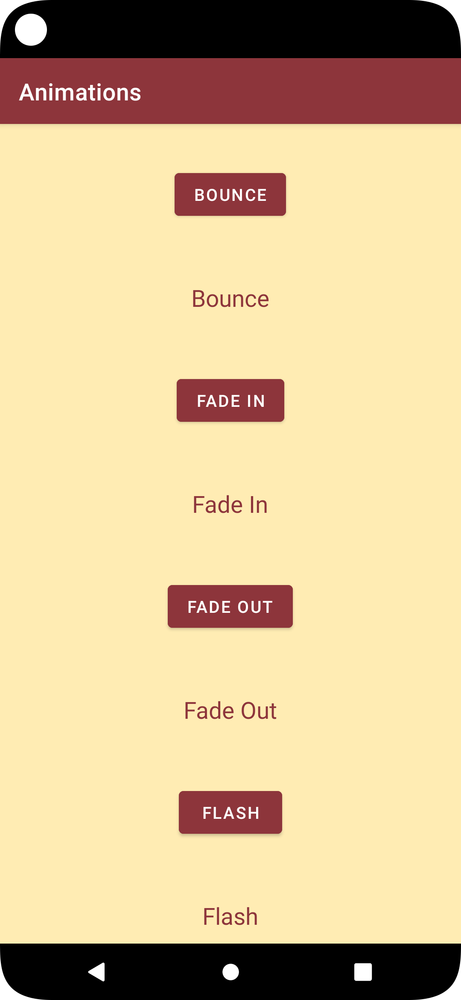
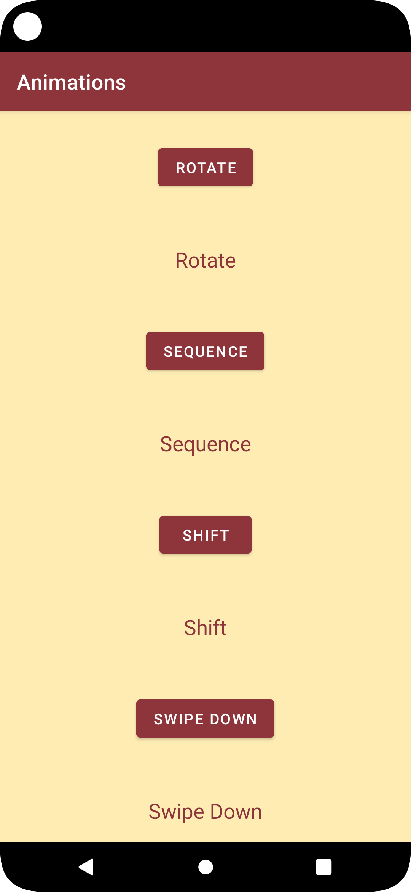
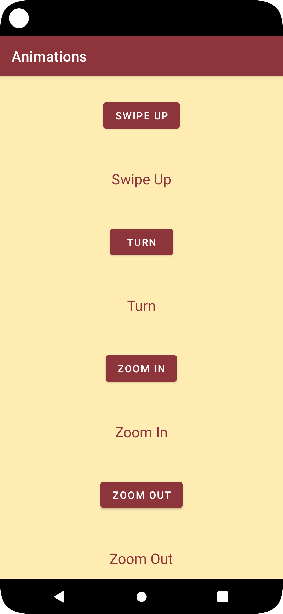

# Android Animations
## Screen preview
<p float="left">



</p>

## List of animations
This list conatain the animations which are present in the project:
|Name|Description|
|-|-|
|Bounce|Bouncy effect of the object to which it is applied|
|Fade in|Gradual appearance effect of the object to which it is applied|
|Fade out|Gradual disappearance effect of the object to which it is applied|
|Flash|Flashing effect of the object to which it is applied|
|Rotate|Rotating effect of the object to which it is applied|
|Sequence|Sequential effect of the object to which it is applied|
|Shift|Sliding effect of the object to which it is applied|
|Swipe down|Effect scrolling up of the object to which it is applied|
|Swipe up|Effect scrolling down of the object to which it is applied|
|Turn|Turning effect of the object to which it is applied|
|Zoom in|Zoom increase effect of the object to which it is applied|
|Zoom out|Zoom decrease effect of the object to which it is applied|

All animation .xml files are contained in the path: ```\Animations\app\src\main\res```

## List of attribute
This list conatain some attributes which which i am using in the project:
|XML Attributes|Description|
|-|-|
|android:duration|It is used to specify the duration of animation to run|
|android:fromAlpha|It is the starting alpha value for the animation, where 1.0 means fully opaque and 0.0 means fully transparent|
|android:toAlpha|It is the ending alpha value|
|android:id|Sets unique id of the view|
|android:fromYDelta|It is the change in Y coordinate to be applied at the start of the animation|
|android:toYDelta|It is the change in Y coordinate to be applied at the end of the animation|
|android:startOffset|Delay occur when an animation runs (in milliseconds), once start time is reached|
|android:pivotX|It represents the X-axis coordinates to zoom from starting point|
|android:pivotY|It represents the Y-axis coordinates to zoom from starting point|
|android:fromXScale|Starting X size offset|
|android:fromYScale|Starting Y size offset|
|android:toXScale|Ending of X size offset|
|android:toYScale|Ending of Y size offset|
|android:fromDegrees|Starting angular position, in degrees|
|android:toDegrees|Ending angular position, in degrees|
|android:interpolator|An interpolator defines the rate of change of an animation|
